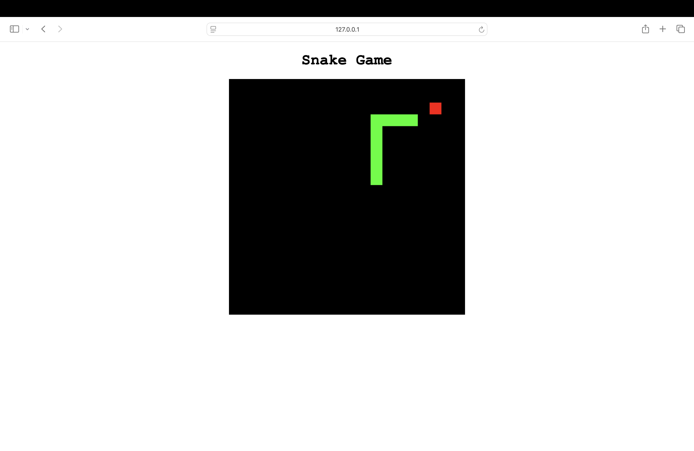

# 🐍 Snake Game

A simple, classic Snake game built using **HTML5 Canvas** and **vanilla JavaScript**.  
Eat the food, grow the snake, and avoid hitting the walls or yourself!

---

## 📸 Screenshot

> _(Replace with an actual screenshot file in your project directory)_

---

## 🎮 Features

- Classic snake gameplay
- Canvas-based rendering
- Real-time movement using arrow keys
- Snake grows after eating food
- Collision detection with self and boundaries
- Game over notification

---

## 🛠️ Technologies Used

- HTML5
- CSS3
- JavaScript (ES6)
- Canvas API
